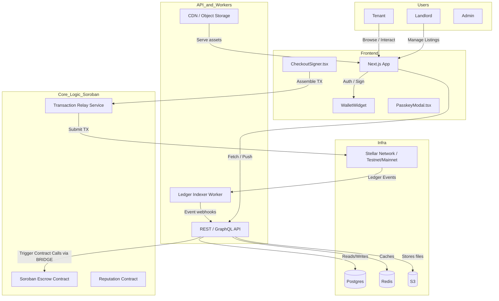

# StellarPad Frontend

**A production-ready React + Next.js frontend for tokenized property marketplaces on the Stellar network.** StellarPad Frontend delivers an intuitive tenant/landlord marketplace experience with embedded on‑chain escrow, passkey and wallet auth, and lightweight Soroban smart contract integrations—reducing friction compared to legacy escrow platforms and centralized marketplaces.

## Overview
StellarPad Frontend is the single-page application that powers a tokenized property marketplace. End users (tenants and landlords) browse listings, initiate deposits/payments, and complete lease checkouts through an accessible UX that combines instant client-side validation, passive background transaction assembly, and guided multi-step checkouts. Automated mechanics include wallet/passkey authentication, on‑device transaction pre-signing, escrow creation, and event-driven UI updates reflecting on‑chain state changes.

Under the hood the frontend is designed to integrate with a Soroban-based contract layer on Stellar for escrow and reputation tracking, and a lightweight API/worker layer for indexing ledger events and serving off‑chain content (images, metadata). Typical transaction costs are kept low via aggregated operations and pre-authorized multi-op transactions; onboarding friction is minimized using passkey auth, an opinionated `WalletWidget` that can inject Stellar WebAuthn flows, and a native checkout flow implemented in `src/components/property-data.ts` and `src/lib/stellar/index.ts`. Smart contract logic enforces escrow atomicity, multi-signature release rules, and role-based access for dispute resolution.

Note: this repository contains the frontend application and UI components. Relay, indexer, and backend services described in this document are conceptual or implemented in separate repositories/services and are not included in this frontend-only codebase.

## Features
- **Marketplace Listings:** Responsive grid of property cards with filters, maps, and faceted search.  
- **On-Chain Escrow:** Create and manage escrow accounts using Soroban contracts and pre-authorized Stellar transactions.  
- **Passkey & Wallet Auth:** Seamless passkey (WebAuthn) and injected Stellar wallet flows (`WalletWidget`) for passwordless onboarding.  
- **Checkout Flow:** Multi-step checkout with client-side signing and server-side transaction submission (`CheckoutSigner.tsx`).  
- **Dispute Management:** Tenants and landlords can open disputes; admin-managed arbitration flow (`DisputeManager.tsx`).  
- **Role Dashboards:** Separate landlord and tenant dashboards with analytics and reputation tracking.  
- **Progressive UX:** Optimistic UI, background indexing, and push-like notifications for ledger events.

## Architecture


### Core Components
- `src/lib/stellar/index.ts` — Stellar/Soroban RPC helpers, transaction builder, and wallet adapters.
- `src/components/CheckoutSigner.tsx` — Client-side transaction assembly and WebAuthn/passkey integration.
- `src/components/WalletWidget.tsx` — Multi-wallet connector (injected wallets, desktop wallets, WebAuthn).
- `src/components/PropertyCard.tsx` & `src/components/PropertyDetailView.tsx` — Listing presentation, pricing conversion, and escrow initiation UI.
- `src/components/DisputeManager.tsx` — Dispute lifecycle UI and admin action hooks.
- `src/context/wallet-context.tsx` — Wallet and session state provider, optimistic UI hooks.
- `api/ledger-indexer/worker.ts` (conceptual) — Worker that subscribes to Stellar ledger effects and writes normalized events to Postgres.

### Revenue Split Model
| Recipient | Allocation |
|---|---:|
| Platform Fee (operational) | 2.5% |
| Escrow Holdback (insurance reserve) | 0.5% |
| Listing Owner (landlord) | 97% |

Example: For a 100 XLM rental deposit:
- Platform: 2.5 XLM  
- Reserve: 0.5 XLM  
- Landlord: 97 XLM

## Tech Stack
| Component | Technology | Purpose |
|---|---|---|
| Frontend framework | Next.js 14 (React + App Router) | UI & SSR |
| Styling | Tailwind CSS + PostCSS | Rapid responsive styling |
| Wallet / Auth | WebAuthn (passkeys) + Stellar Wallet Adapter | Passwordless auth & signing |
| Blockchain | Stellar Network (Soroban contracts) | Escrow, reputation, settlement |
| Backend / Indexer | Node.js + TypeScript | Ledger indexing, relay, API |
| Database | Postgres 15 | Persistent state & events |
| Cache | Redis | Session & rate limiting |
| Storage | S3-compatible (MinIO) | Media and metadata |
| CI/CD | GitHub Actions | Build, test, deploy |

## Smart Contract Functions / Core API Methods
Author (Landlord) / Owner Functions:
- `create_listing(listingId, metadataUri, price, owner)`  
- `update_listing(listingId, metadataUri, price)`  
- `withdraw_funds(listingId)`  

Reader (Tenant) Functions:
- `initiate_deposit(listingId, buyer, amount)`  
- `confirm_checkin(escrowId, buyer)`  
- `request_refund(escrowId, buyer)`  

Admin Functions:
- `resolve_dispute(escrowId, outcome)`  
- `pause_contract()`  
- `unpause_contract()`  

Query / View Functions:
- `get_listing(listingId) -> Listing`  
- `get_escrow_state(escrowId) -> EscrowState`  
- `get_user_reputation(accountId) -> ReputationScore`

Client-side API endpoints (examples):
- `POST /api/transactions/relay` — Accepts signed xdr, submits to Stellar via horizon.  
- `GET /api/indexer/events?since=cursor` — Stream ledger-derived events for UI synchronization.  
- `POST /api/listings` — Create listing metadata (backend persists to DB + storage).

## Project Lifecycle — Sequence Diagram

```mermaid
sequenceDiagram
	rect rgba(220,235,255,0.9)
		participant Tenant
		participant Frontend
		participant Wallet
	end
	rect rgba(230,250,230,0.9)
		participant Relay
		participant Indexer
	end
	rect rgba(255,245,220,0.9)
		participant Soroban
		participant DB
	end

	Tenant->>Frontend: Click "Book / Deposit"
	Frontend->>Wallet: Request signature (build XDR)
	Wallet-->>Frontend: Signed XDR
	Frontend->>Relay: POST /transactions/relay (signed XDR)
	Relay->>Soroban: Submit to Horizon -> Soroban contract
	Soroban->>Indexer: Ledger effect (escrow created)
	Indexer->>DB: Persist escrow event
	Indexer->>Frontend: Webhook / SSE: escrow.created
	Frontend->>Tenant: Update UI -> "Deposit Confirmed"
```


## Project Lifecycle — State Machine
ASCII state diagram:
```
+---------+    create_deposit    +--------+    confirm_checkin   +-------+
|  Minted | ------------------>  | Escrow | ------------------>  | Closed|
+---------+                      +--------+                      +-------+
		 |                                |
		 | list_for_rent                   | dispute_open
		 v                                v
	+-------+                       +------------+
	| Listed|                       | Disputed   |
	+-------+                       +------------+
```

Valid Transitions:
| From | To | Trigger |
|---|---|---|
| Minted | Listed | `create_listing()` |
| Listed | Escrow | `initiate_deposit()` |
| Escrow | Closed | `confirm_checkin()` |
| Escrow | Disputed | `open_dispute()` |
| Disputed | Closed | `resolve_dispute()` |

## Security Features
1. Signed tx relay: frontend never holds private keys—only signed XDRs are submitted.  
2. Multi-sig escrow: escrows use multi-signature rules requiring buyer + platform + optional arbiter approvals.  
3. Contract immutability: Soroban contracts are versioned and governance-locked; state transitions validated on-chain.  
4. Least-privilege API keys: Relay and indexer services use scoped service credentials (no global DB root).  
5. Rate limiting & replay protection: Nonces and Redis-backed rate limits for transaction relays.  
6. Audit logging: Every on-chain submission and contract admin action is logged in Postgres and an append-only audit table.  
7. CSP & secure headers: Frontend enforces strict Content-Security-Policy and secure cookies for session endpoints.

## Quick Start

🚀 Complete Testnet/Local Setup (Recommended)

Linux / macOS (bash)
```bash
# Clone
git clone https://github.com/StellarPad/StellarPad-Frontend.git
cd StellarPad-Frontend

# Install
pnpm install

# Start local indexer & mock services (recommended)
# - assumes docker-compose defines indexer, postgres, redis, minio
docker compose up -d

# Environment (copy example)
cp .env.example .env

# Build & run frontend
pnpm build
pnpm start
```

Windows (PowerShell)
```powershell
# Clone
git clone https://github.com/StellarPad/StellarPad-Frontend.git
cd StellarPad-Frontend

# Install
pnpm install

# Start docker services (requires Docker Desktop)
docker compose up -d

# Environment
Copy-Item .env.example .env

# Build & run
pnpm build
pnpm start
```

Component-specific sub-steps
- Install:
	```bash
	pnpm install
	```

- Build:
	```bash
	pnpm build
	```

- Deploy (example static hosting):
	```bash
	pnpm export
	rsync -av out/ user@cdn:/var/www/stellarpad
	```

- Initialize (local services):
	```bash
	docker compose exec api pnpm db:migrate
	docker compose exec api pnpm seed:init
	```

- Run Frontend (dev):
	```bash
	pnpm dev
	# open http://localhost:3000
	```

## How It Works
1. A landlord creates a listing through the UI; metadata is stored in S3 and indexed in Postgres.  
2. A tenant selects a listing and starts checkout; the frontend builds a Soroban-compatible transaction (deposit into escrow).  
3. The user signs via `WalletWidget` (passkey or injected wallet) producing signed XDR.  
4. The signed XDR is POSTed to the Relay (`/api/transactions/relay`) which forwards to Stellar Horizon.  
5. The Indexer observes ledger effects, normalizes events, stores in Postgres, and pushes UI updates to clients.  
6. Upon check-in confirmation, the escrow contract releases funds according to the revenue split; on disputes, admin triggers `resolve_dispute()`.

## Environment Validation
We run automated schema and env validation on CI. A minimal `.env` validation script (`scripts/validate-env.ts`) ensures required variables like `HORIZON_URL`, `SOROBAN_RPC`, `DATABASE_URL`, and `S3_ENDPOINT` are present before start.

## Configuration
Create a `.env` at project root with the following keys.

| Variable | Description |
|---|---|
| HORIZON_URL | Stellar Horizon RPC endpoint (e.g., https://horizon-testnet.stellar.org) |
| SOROBAN_RPC | Soroban RPC / wasm host URL |
| DATABASE_URL | Postgres connection string |
| REDIS_URL | Redis connection string for caching and rate limits |
| S3_ENDPOINT | S3-compatible endpoint for media |
| NEXT_PUBLIC_APP_URL | Public URL for the frontend |
| NEXT_PUBLIC_NETWORK | "testnet" or "mainnet" |

## Testing
Run frontend and backend tests:

```bash
# Run unit & integration tests
pnpm test
# Frontend only
pnpm test --filter=frontend
# Backend / indexer tests
pnpm -w --filter api test
```

Test coverage assertions:
- UI: listing render, checkout flow, and optimistic updates covered.  
- Wallet: passkey and wallet adapter signing mocked and validated.  
- Indexer: ledger event normalization and idempotency checks.  
- Contracts: local Soroban unit tests for escrow state transitions and dispute resolution.

## MVP Scope
Included in MVP:
- Listing creation, editing, and search.  
- Deposit/escrow checkout with on-chain settlement.  
- Passkey and wallet-based auth.  
- Landlord and tenant dashboards.  
- Dispute submission and admin resolution.  
Deferred / Post-MVP:
- Cross-listing with external marketplaces.  
- Advanced analytics & pricing suggestions.  
- Mobile-native app and push notifications.

## Roadmap
- [x] MVP: Listings, escrow, basic auth, indexer
- [x] CI: Lint, test, build pipelines
- [ ] Multi-sig arbiter flows and insurance reserve automation
- [ ] Mobile PWA optimizations
- [ ] On-chain reputation staking & incentives

## Dependencies
- next: 14.0.0
- react: 18.2.0
- tailwindcss: 4.3.0
- pnpm: 8.x (development)
- soroban-client: 0.1.0 (WASM/Soroban helpers)
- @stellar/horizon-client: 8.0.0
- typescript: 5.5
- jest: 29.6

## Error Codes
| Code | Error | Description | Common Cause | Resolution |
|---:|---|---|---|---|
| E_TX_RELAY_001 | TransactionRejected | Relay rejected signed XDR | Insufficient fee or malformed XDR | Inspect relay logs, check fee and XDR encoding |
| E_IDX_002 | IndexerSyncFail | Indexer halted | Horizon rate limit or schema mismatch | Restart indexer, check DB migrations |
| E_AUTH_003 | AuthFailure | Wallet signature not accepted | User canceled signing or wrong origin | Retry signing, validate origin & CORS |
| E_CONTRACT_004 | EscrowInvalidState | Contract rejected action | Action not allowed in current contract state | Validate state via `get_escrow_state()` |
| E_API_005 | DBWriteErr | Failed to persist event | DB outage or constraint violation | Inspect DB logs, retry with idempotency key |

## Events
| Event | Emitted By | When |
|---|---|---|
| `escrow.created` | Indexer | After escrow creation ledger effect |
| `escrow.released` | Indexer / Contract | When funds released to landlord |
| `dispute.opened` | API | When tenant/landlord files a dispute |
| `listing.created` | API | After metadata persisted and indexed |
| `reputation.changed` | Contract / Indexer | On reputation stake or penalty |

## License
This project is licensed under the MIT License — see LICENSE for details.

## Support
For production support, open an issue on GitHub or contact the maintainers via the repository's discussion board. For urgent incidents, use the `#infra` channel in the project's Slack.

## Contributing
Contributions are welcome. Please:
- Fork the repo and create a feature branch.  
- Ensure all tests pass locally and CI runs clean.  
- Open a pull request with a clear description and link to relevant issues.  
- Follow the repository's coding standards and run `pnpm lint` before submitting.

 
